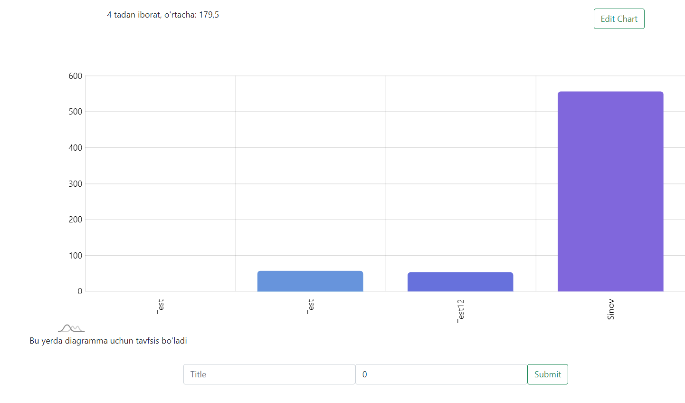

# **amCharts**

## Deploy Here
### Deploy To [Heroku](https://heroku.com)

### Deploy To [Digitalocean](https://digitalocean.com)

### **Front-end and Backend**

#### Verified Accounts

#### `Follow` & `Unfollow`

#### Search `User` and `Charts`
##### Search Chart

##### Search `User`

#### Chart
##### Column Chart

##### Pie Chart

##### `Update` Chart

##### and others
###### Also, through this site, creators can pin their diagrams to their profile, users can like or dislike diagrams.